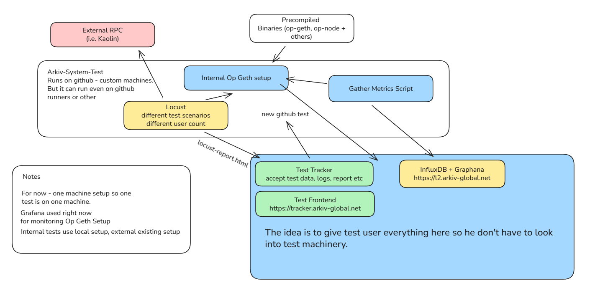

## Note for external collaborators

this is only part of greater system which is not yet fully public.

Use this only as a reference. 

## Test tracker is the place to go

[Test Tracker - Main page](https://tracker.arkiv-global.net)

## Visual overview of the system

## Other stuff

### useful greps for op batcher logs debugging

cat op-batcher.log | grep "Loading range of multiple blocks into state" 

cat op-batcher.log | grep "Added L2 block to local state"
